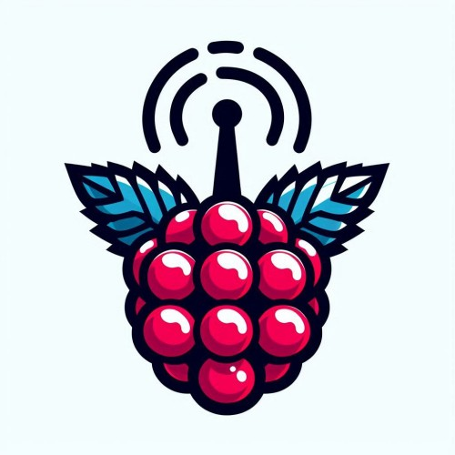

<a id="readme-top"></a>

[![Contributors][contributors-shield]][contributors-url]
[![Forks][forks-shield]][forks-url]
[![Stargazers][stars-shield]][stars-url]
[![Issues][issues-shield]][issues-url]
[![MIT license][license-shield]][license-url]
[![LinkedIn][linkedin-shield]][linkedin-url]


<!-- PROJECT LOGO -->
<br />
<div align="center">
  <a href="https://github.com/HarleyDavidson86/radiopi">
    
  </a>

<h3 align="center">Radio Pi</h3>

  <p align="center">
    Turn your raspberry pi into an internet radio client.
    <br />
    <a href="https://github.com/HarleyDavidson86/radiopi"><strong>Explore the docs »</strong></a>
    <br />
    <br />
    <a href="https://github.com/HarleyDavidson86/radiopi">View Demo</a>
    &middot;
    <a href="https://github.com/HarleyDavidson86/radiopi/issues/new?labels=bug&template=bug-report---.md">Report Bug</a>
    &middot;
    <a href="https://github.com/HarleyDavidson86/radiopi/issues/new?labels=enhancement&template=feature-request---.md">Request Feature</a>
  </p>
</div>


<!-- TABLE OF CONTENTS -->
<details>
  <summary>Table of Contents</summary>
  <ol>
    <li>
      <a href="#about-the-project">About The Project</a>
    </li>
    <li>
      <a href="#getting-started">Getting Started</a>
      <ul>
        <li><a href="#prerequisites">Prerequisites</a></li>
        <li><a href="#installation">Installation</a></li>
      </ul>
    </li>
    <li><a href="#usage">Usage</a></li>
    <li><a href="#roadmap">Roadmap</a></li>
    <li><a href="#contributing">Contributing</a></li>
    <li><a href="#license">License</a></li>
    <li><a href="#contact">Contact</a></li>
    <li><a href="#acknowledgments">Acknowledgments</a></li>
  </ol>
</details>


<!-- ABOUT THE PROJECT -->
## About The Project

With this project, a Raspberry Pi can be converted into an Internet radio client.
The radio can be operated via a web interface. 

<p align="right">(<a href="#readme-top">back to top</a>)</p>


<!-- GETTING STARTED -->
## Getting Started

This is an example of how you may give instructions on setting up your project locally.
To get a local copy up and running follow these simple example steps.

### Prerequisites

This is an example of how to list things you need to use the software and how to install them.
* mplayer
  ```sh
  sudo apt install mplayer
  ```
* screen
  ```sh
  sudo apt install screen
  ```

### Installation for local development / testing

First install the following needed packages:
```sh
sudo apt install mplayer screen php
```
Then give all scripts in directory `cmd` rights to be executed.

Create a subdirectory `radiostations`and configure at least one 
station (see next chapter).

Start a development php server in the current directory with
```sh
sudo php -S localhost:80
```
and browse to http://localhost

### Installation on a raspberry pi

TBD

<p align="right">(<a href="#readme-top">back to top</a>)</p>


<!-- USAGE EXAMPLES -->
## Configuration

### Setup a radio station

To add a new radio station you need two things:

1. The streaming url
2. The logo of the radio station as a square png

Copy the logo into the subdirectory `radiostations` and give it a short
name containing no spaces.

Create a textfile with the same name containing the full name
of the radio station (the display name) and the streaming url 
separated by a semicolon.

For example:
```
./radiostations/radiostation1.png
./radiostations/radiostation1.txt
```
Contents of `radiostation1.txt`:
```
Rock around the clock radio;https://ratc.com/streaming-url
```

## Usage

TBD

<p align="right">(<a href="#readme-top">back to top</a>)</p>


<!-- ROADMAP -->
## Roadmap

- [ ] Rest endpoints for turn the radio on and off by homeassistant
- [ ] Configuration over browser gui
- [ ] ...

See the [open issues](https://github.com/HarleyDavidson86/radiopi/issues) for a full list of proposed features (and known issues).

<p align="right">(<a href="#readme-top">back to top</a>)</p>


<!-- CONTRIBUTING -->
## Contributing

Contributions are what make the open source community such an amazing place to learn, inspire, and create. Any contributions you make are **greatly appreciated**.

If you have a suggestion that would make this better, please fork the repo and create a pull request. You can also simply open an issue with the tag "enhancement".
Don't forget to give the project a star! Thanks again!

1. Fork the Project
2. Create your Feature Branch (`git checkout -b feature/AmazingFeature`)
3. Commit your Changes (`git commit -m 'Add some AmazingFeature'`)
4. Push to the Branch (`git push origin feature/AmazingFeature`)
5. Open a Pull Request

<p align="right">(<a href="#readme-top">back to top</a>)</p>

### Top contributors:

<a href="https://github.com/HarleyDavidson86/radiopi/graphs/contributors">
  
</a>


<!-- LICENSE -->
## License

Distributed under the MIT license. See `LICENSE.txt` for more information.

<p align="right">(<a href="#readme-top">back to top</a>)</p>


<!-- CONTACT -->
## Contact

Mastodon: [https://jit.social/@itwerkstatt](https://jit.social/@itwerkstatt)

Project Link: [https://github.com/HarleyDavidson86/radiopi](https://github.com/HarleyDavidson86/radiopi)

<p align="right">(<a href="#readme-top">back to top</a>)</p>


<!-- ACKNOWLEDGMENTS -->
## Acknowledgments

* [Blog enty on administrator.de ](https://administrator.de/tutorial/webradio-mit-webinterface-mit-raspberry-pi-328898.html)
* [Wiki entry of wiki.lugsaar.de](https://wiki.lugsaar.de/projekte/internetradio)

<p align="right">(<a href="#readme-top">back to top</a>)</p>


<!-- MARKDOWN LINKS & IMAGES -->
<!-- https://www.markdownguide.org/basic-syntax/#reference-style-links -->
[contributors-shield]: https://img.shields.io/github/contributors/HarleyDavidson86/radiopi.svg?style=for-the-badge
[contributors-url]: https://github.com/HarleyDavidson86/radiopi/graphs/contributors
[forks-shield]: https://img.shields.io/github/forks/HarleyDavidson86/radiopi.svg?style=for-the-badge
[forks-url]: https://github.com/HarleyDavidson86/radiopi/network/members
[stars-shield]: https://img.shields.io/github/stars/HarleyDavidson86/radiopi.svg?style=for-the-badge
[stars-url]: https://github.com/HarleyDavidson86/radiopi/stargazers
[issues-shield]: https://img.shields.io/github/issues/HarleyDavidson86/radiopi.svg?style=for-the-badge
[issues-url]: https://github.com/HarleyDavidson86/radiopi/issues
[license-shield]: https://img.shields.io/github/license/HarleyDavidson86/radiopi.svg?style=for-the-badge
[license-url]: https://github.com/HarleyDavidson86/radiopi/blob/master/LICENSE.txt
[linkedin-shield]: https://img.shields.io/badge/-LinkedIn-black.svg?style=for-the-badge&logo=linkedin&colorB=555
[linkedin-url]: https://linkedin.com/in/dominik-sust-253a53324
[product-screenshot]: images/screenshot.png
[Next.js]: https://img.shields.io/badge/next.js-000000?style=for-the-badge&logo=nextdotjs&logoColor=white
[Next-url]: https://nextjs.org/
[React.js]: https://img.shields.io/badge/React-20232A?style=for-the-badge&logo=react&logoColor=61DAFB
[React-url]: https://reactjs.org/
[Vue.js]: https://img.shields.io/badge/Vue.js-35495E?style=for-the-badge&logo=vuedotjs&logoColor=4FC08D
[Vue-url]: https://vuejs.org/
[Angular.io]: https://img.shields.io/badge/Angular-DD0031?style=for-the-badge&logo=angular&logoColor=white
[Angular-url]: https://angular.io/
[Svelte.dev]: https://img.shields.io/badge/Svelte-4A4A55?style=for-the-badge&logo=svelte&logoColor=FF3E00
[Svelte-url]: https://svelte.dev/
[Laravel.com]: https://img.shields.io/badge/Laravel-FF2D20?style=for-the-badge&logo=laravel&logoColor=white
[Laravel-url]: https://laravel.com
[Bootstrap.com]: https://img.shields.io/badge/Bootstrap-563D7C?style=for-the-badge&logo=bootstrap&logoColor=white
[Bootstrap-url]: https://getbootstrap.com
[JQuery.com]: https://img.shields.io/badge/jQuery-0769AD?style=for-the-badge&logo=jquery&logoColor=white
[JQuery-url]: https://jquery.com 